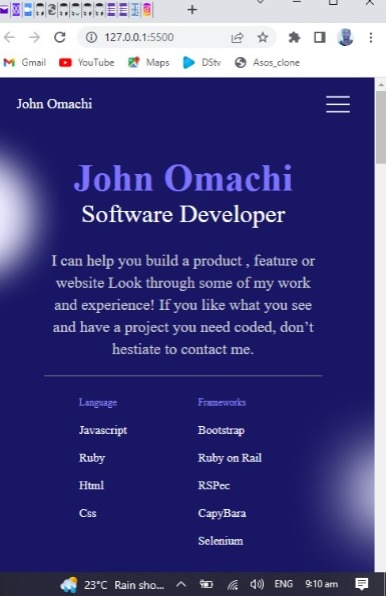

# Portfolio project Bootstrap

> This Project is a clone of a Portfolio template from figma

## Built With

- HTML/CSS
- NPM, Git, Github

## Getting Started

**this website can be viewd better on all screen sizes**

**The purpose of these project is to build portfolio website with bootstrap using the figma template.**

To get a local copy up and running follow these simple example steps.

## Clone The Repositiry to your local machine by following the steps below

Step 1: Type the following command into a git shell

git clone https://github.com/MrOmachi/Portfolio-Bootstrap.git

Step 2: Direct a terminal into the cloned repository directory

### Setup

Set up folder as:

1. /PORTFOLIO-MICROVERSE -.github/workflows - linters.yml
   - images
     - github.png
     - hamburger.png
     - twitter.png
     - Vector.png
     - vector2.png
     - vector3.png
     - portfolioImg.jpeg
     - ImgPlaceholder.png
   - index.html
   - LICENSE

### Deployment

## Authors

👤 **Omachi John Sunday & Addis Tsega**

- GitHub: [@githubhandle](https://github.com/MrOmachi)
- Twitter: [@twitterhandle](https://twitter.com/Mr_Omachi)
- LinkedIn: [LinkedIn](https://www.linkedin.com/mwlite/in/john-omachi-00446210b)
  **&**
- GitHub: [@githubhandle](https://github.com/Aseadd)
- Twitter: [@twitterhandle](https://twitter.com/adaTsega)
- LinkedIn: [LinkedIn](https://linkedin.com/in/addistsega)

## 🤝 Contributing

Contributions, issues, and feature requests are welcome!

Feel free to check the [issues page](../../issues/).

## Show your support

Give a ⭐️ if you like this project!

## 📝 License

This project is [MIT](./MIT.md) licensed.
